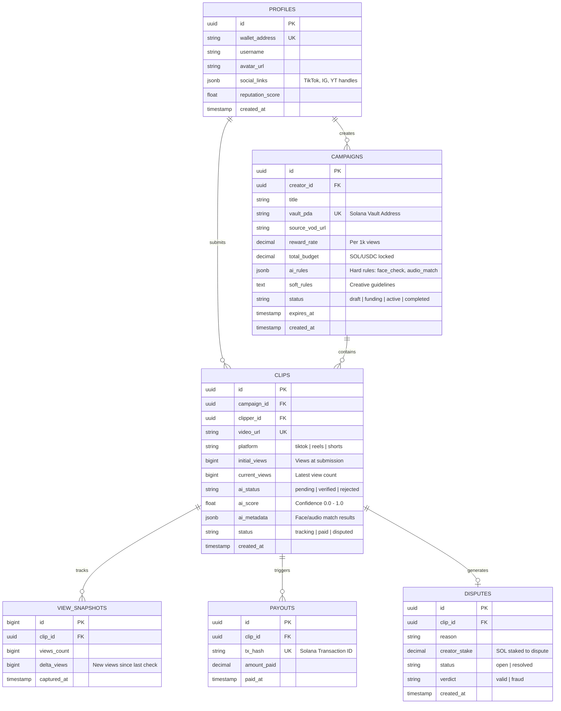

This ERD is designed for **Supabase (PostgreSQL)**. It utilizes `JSONB` for flexible AI rules and metadata, and `UUIDs` for primary keys to align with Supabase Auth.

Since **Kern** is a "Financial Terminal," this structure prioritizes the relationship between the **Vault (Campaign)**, the **Evidence (Clips)**, and the **Ledger (Snapshots/Payouts)**.

### Key Technical Decisions in this Schema:

* **`PROFILES` Table:** I’ve kept this lean. In Supabase, you’ll likely link this to `auth.users` via a trigger. The `reputation_score` is what clippers use to "level up."
* **`CAMPAIGNS.ai_rules` (JSONB):** Instead of creating 20 columns for different AI checks, using JSONB allows you to add new checks (like "Sentiment Analysis" or "Background Music Check") without migrating your database.
* **`CLIPS.initial_views`:** This is crucial. When a clipper submits a link, your Python backend grabs the views *at that exact moment*. This ensures the creator only pays for **new** growth.
* **`VIEW_SNAPSHOTS`:** This is your "Chron Job" table. Every 24 hours, you insert a new row here. This allows you to build those beautiful "Growth Charts" for the Creator Dashboard.
* **`DISPUTES`:** I included a `creator_stake` column. As we discussed, this prevents creators from disputing clips just to avoid paying—they have to put skin in the game.

### Implementation Tip for Supabase:

Since you’re using **Solana**, you don't need to store private keys (obviously). However, you should use **Postgres RLS (Row Level Security)** to ensure that a clipper can't see the "AI Score" of another clipper, and only the creator can edit their own campaign rules.