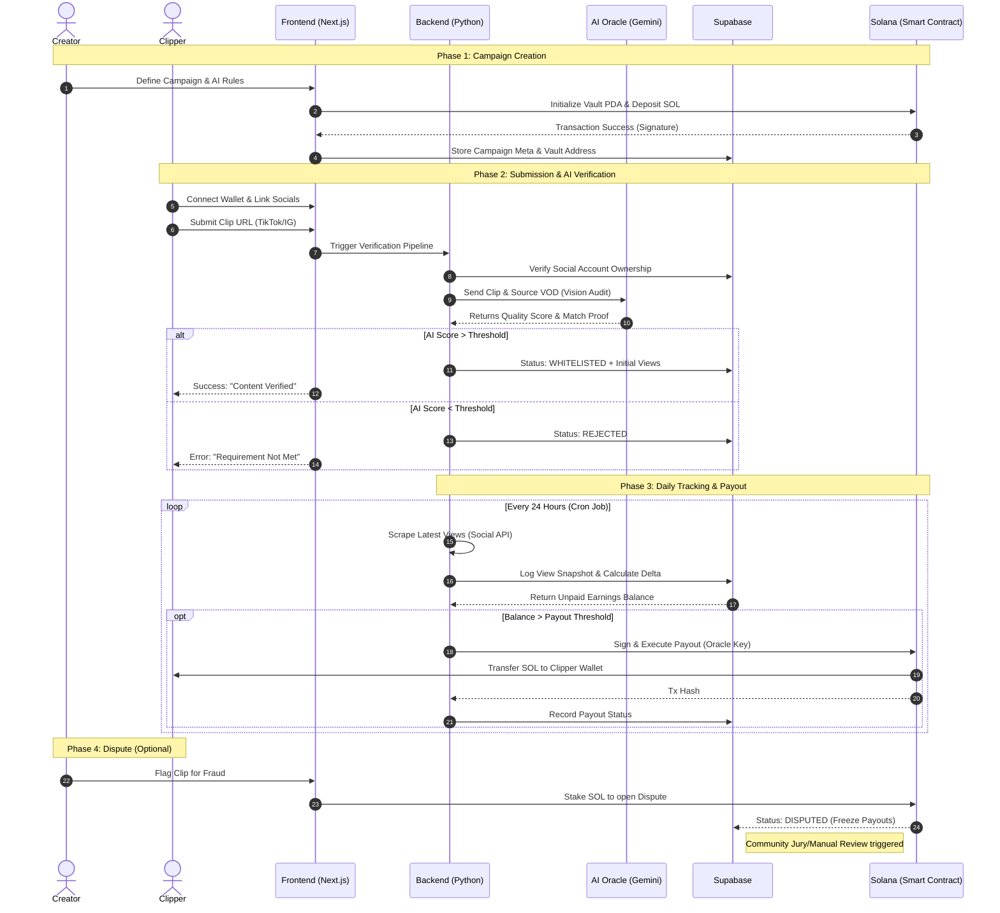

# HERE IS THE SEQUENCE DIAGRAM
This sequence diagram maps out the three core phases of **Kern**: the **Trustless Escrow** (Creator setup), the **AI Oracle Audit** (Clipper submission), and the **Automated Settlement** (Scheduled tracking).

### Key Logic Highlights in the Diagram:

1. **The Oracle Separation (Steps 8-9):** Notice that the AI only interacts with the Backend once. This is the expensive "Vision Check." Once that's done, the clip moves into a low-cost tracking loop.
2. **Initial Views (Step 10):** The system records the views at the moment of submission to ensure the creator only pays for the *growth* generated by the clipper, not existing views.
3. **The "Oracle Key" (Step 16):** This is the bridge. The Solana contract won't pay the clipper just because they asked; it only pays because your **Backend (the Oracle)** provided a cryptographic signature proving the work was done.
4. **Batching (Step 15):** The "Opt" block ensures you aren't spamming the network with tiny transactions. It only triggers the Solana transaction once the clipper has earned enough to make the gas fee worth it.

This flow keeps the user experience fast for the clipper (instant feedback on verification) while keeping the creator's funds secure in a milestone-based maturation cycle.